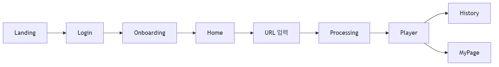
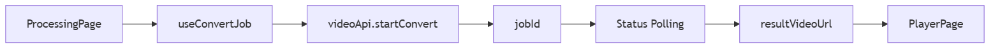
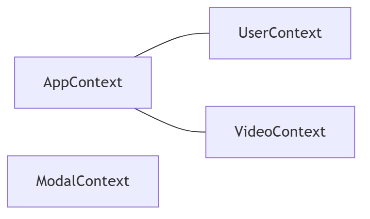
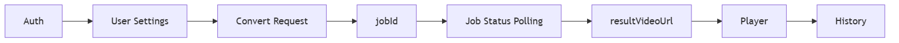

# 공농 (EST_Gongnong)

유튜브 영상 링크를 입력하면 AI가 수어 통역 영상으로 변환해주는 서비스입니다. 이 저장소는 프론트엔드(React SPA)를 담당합니다.

**현재 백엔드는 연결되어 있지 않습니다.** 개발용 데모 로그인과 Mock 데이터로 전체 화면 흐름만 끝까지 확인할 수 있는 상태이며, 구체적인 범위는 8번 항목에 정리했습니다.

## 1. Frontend 소개

프론트엔드는 사용자가 유튜브 링크로 수어 변환을 요청하고, 진행 상태를 확인한 뒤, 완성된 수어 영상을 원본과 함께 재생하고 기록을 관리하는 전체 화면을 담당합니다.

```
YouTube 영상 입력 → 변환 요청 → 진행 상태 확인 → 수어 영상 재생 → 변환 기록 관리
```

## 2. Frontend Pipeline

### 사용자 흐름



`/home`부터 `/player`까지는 로그인 + 온보딩 완료를 모두 거쳐야 진입할 수 있습니다(`RequireAuth` → `RequireOnboarding`).

### 영상 변환 흐름 (코드 기준)



- `jobId`는 `sessionStorage`에 저장되어, 새로고침 시 새 요청 대신 기존 작업 상태를 이어서 조회합니다(2초 간격 polling).
- 백엔드가 없는 현재는 `startConvert`/`status` 호출이 항상 실패하므로, 실제로는 Status Polling 단계에서 에러 UI로 끝납니다.
- `resultVideoUrl`이 없으면 `PlayerPage`는 자동으로 가짜 타이머 재생(Mock)으로 대체합니다.

## 3. 주요 페이지

| Route | Page | 역할 | 접근 조건 |
|---|---|---|---|
| `/` | LandingPage | 서비스 소개 | 공개 |
| `/login` | LoginPage | 로그인 (일반/데모) | 공개 |
| `/onboarding` | OnboardingPage | 초기 설정 (이름/연령대/관심사/화면 모드) | 공개 |
| `/home` | HomePage | 유튜브 URL 입력, 변환 시작 | 인증 + 온보딩 |
| `/processing` | ProcessingPage | 변환 진행률 / 실패 UI | 인증 + 온보딩 |
| `/player` | PlayerPage | 원본·수어 영상 동기화 재생 | 인증 + 온보딩 |
| `/history` | HistoryPage | 변환 기록, 그룹 관리 | 인증 + 온보딩 |
| `/mypage` | MyPage | 프로필/설정, 로그아웃 | 인증 + 온보딩 |
| `*` | - | `/`로 리다이렉트 | - |

## 4. 주요 기능

- 로그인/온보딩, 개발용 데모 로그인(DEV 전용)
- 유튜브 URL 입력 및 형식 검증
- jobId 기반 변환 상태 폴링 + 새로고침 후 재개
- Player: 동기화 재생, 레이아웃 전환, 자막, 재생 속도, 저신뢰 구간 배너, 화면 모드
- History: 기록 목록, 그룹 생성/관리
- MyPage: 프로필, 자막/속도 설정, 로그아웃

## 5. 상태 관리 구조

Context + `useReducer`만 사용하고 외부 상태관리 라이브러리는 없습니다.



- **AppContext**: `UserContext`/`VideoContext`를 합성해서 제공하는 레거시 호환용 래퍼
- **UserContext**: 프로필/온보딩/사용자 설정/로그인 여부. `onboarding.view` 값이 "온보딩 완료 여부" 판단 기준으로도 쓰입니다.
- **VideoContext**: 변환 기록, 그룹, 현재 입력 URL, 방금 완료된 작업
- **ModalContext**: 로그인/회원가입/기록 관리용 모달 7종의 열림 상태
- 두 상태 모두 메모리 상태라 새로고침 시 초기화됩니다 (인증 토큰만 예외적으로 `localStorage`에 저장)

## 6. API 구조

```
src/api/
├── client.ts    # 공통 fetch 래퍼 (토큰 첨부, 에러 처리)
├── auth.ts      # 로그인/회원가입/계정 찾기
├── video.ts     # 변환 요청, 작업 상태 조회
├── history.ts   # 기록/그룹 API (정의만 있고 미사용)
├── user.ts      # 유저 정보/설정 API (정의만 있고 미사용)
└── tokenStorage.ts
```

`useAuth` → `authApi`, `useConvertJob` → `videoApi`로 이어지는 두 모듈만 실제로 호출되고 있습니다. `history.ts`/`user.ts`는 형태만 잡아둔 상태이며, 전체 연동 현황은 8번 항목을 참고하세요.

## 7. 프로젝트 구조

```
src/
├── api/          # 백엔드 API 클라이언트
├── assets/       # 로고/이미지/영상 등 정적 자산
├── components/   # common(범용 UI), feature(레이아웃/모달/Player 하위 컴포넌트)
├── hooks/        # useAuth, useConvertJob
├── imports/      # 기획/디자인 원본 자산
├── mocks/        # 백엔드 연결 전 목업 데이터
├── pages/        # 라우트 페이지 (landing/ = 랜딩 섹션)
├── routes/       # RequireAuth, RequireOnboarding
├── state/        # Context 기반 전역 상태
├── styles/       # 공용 스타일 헬퍼
├── types/        # 도메인/유저/Job/API 타입
├── utils/        # 순수 유틸 함수
├── constants.ts  # 아이콘/옵션/랜딩 문구 상수
├── App.tsx       # 라우트 정의
└── main.tsx      # 엔트리포인트
```

## 8. 현재 상태

**[완료]** Frontend UI, 라우팅/가드, 로그인→온보딩→홈→변환→재생→기록 관리 사용자 Flow, Player, History, MyPage 화면

**[개발용]** 데모 로그인, Mock 데이터, Player의 가짜 재생 Fallback (아래 표 참고)

**[Backend 연동 필요]**

| 항목 | 현재 상태 |
|---|---|
| `authApi` (로그인/회원가입/계정 찾기) | 엔드포인트 미확정, 데모 계정 외 호출 시 항상 실패 |
| `videoApi` (변환 요청/상태 조회) | 엔드포인트 미확정, 호출 시 항상 실패 |
| `historyApi` | 코드만 존재, 어디서도 호출되지 않음 (Mock 데이터만 사용) |
| `userApi` | 코드만 존재, 어디서도 호출되지 않음 |
| 사용자 설정 영구 저장 | `UserContext` 메모리 상태만 사용, 새로고침 시 초기화 |
| 실제 영상 변환 | 미연동 (요청은 항상 실패) |
| Job Status | 미연동, 2초 폴링 로직만 구현됨 |
| `resultVideoUrl` | 항상 없음 → Player는 Mock 재생으로 폴백 |
| subtitle / confidence segments | `ConvertJob.segments` 필드만 예약, `mocks/subtitles.ts` 목업으로 대체 구현 |

## 9. 기술 스택

`package.json` 기준입니다.

- React 19.0.0 / React DOM 19.0.0
- TypeScript 5.7.0, Vite 8.0.5, React Router 7.0.0
- Tailwind CSS 4.0.0 — 설정만 되어 있고 실제 화면은 대부분 인라인 스타일로 작성됨
- oxfmt 0.2.0 (포맷터)

## 10. 실행 방법

```bash
git clone <repository-url>
cd EST_Gongnong
npm install
npm run dev
```

- 개발 서버 포트: 기본 `8443` (`vite.config.ts`, `PORT` 환경 변수로 변경 가능)
- `npm run build` / `npm run preview` / `npm run format`

환경 변수는 `.env.example`을 `.env.local`로 복사해서 사용합니다.

```
VITE_API_BASE_URL=
```

백엔드 base URL이며, 비워두면 same-origin으로 요청합니다. 백엔드가 없는 현재는 비워둔 채로 사용합니다.

## 11. 데모 계정 (개발 환경 전용)

```
ID: est
Password: 1234
```

> `src/hooks/useAuth.ts`에 `import.meta.env.DEV`로 감싸져 있어 **`npm run dev`에서만 동작**합니다. `npm run build`/`npm run preview`로 만든 프로덕션 빌드에서는 자동으로 비활성화되며, 실 서비스 계정이 아닙니다.

## 12. Backend 연동 Pipeline



`ConvertJob`(`src/types/job.ts`)에는 `subtitleUrl`(자막 URL)과 `segments`(`{start, end, gloss, confidence}` 배열)가 함께 정의되어 있으나 둘 중 어느 쪽을 실제로 내려줄지는 미확정입니다. 확정되면 현재의 `mocks/subtitles.ts` 목업을 대체하면 됩니다.
